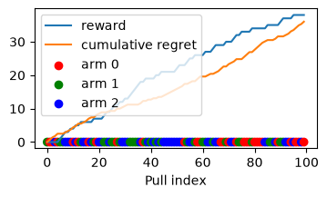
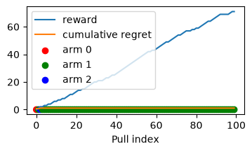
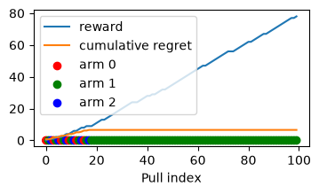
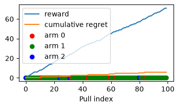
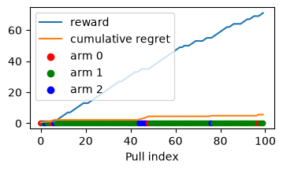
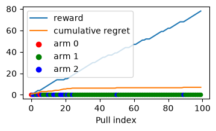

# Multi-Armed Bandit Algorithms

This project implements various Multi-Armed Bandit (MAB) algorithms and visualizes their performance in terms of cumulative reward and regret.

## Algorithms Implemented

### 1. Pure Exploration
The agent selects arms uniformly at random, regardless of past performance. This strategy ensures all arms are explored but fails to exploit the best arm.

### 2. Pure Greedy
The agent initially tries each arm once and subsequently always chooses the arm with the highest observed reward. This often leads to sub-optimal choices if the initial pulls were unlucky.

### 3. Explore-Then-Commit (ETC)
The agent explores all arms for a fixed duration ($N_{explore}$) and then commits to the arm that performed best during the exploration phase.

### 4. Epsilon-Greedy
With probability $\epsilon$, the agent explores a random arm. With probability $1-\epsilon$, it exploits the current best-performing arm.

### 5. Upper Confidence Bound (UCB)
UCB selects arms by considering both the estimated mean reward and the uncertainty (confidence interval) associated with that estimate. It prioritizes arms that have high potential or haven't been pulled often.

### 6. Thompson Sampling
A Bayesian approach where the agent maintains a probability distribution (Beta distribution) for each arm's success probability. It samples from these distributions and selects the arm with the highest sampled value.

## Environment
The environment is a Bernoulli Bandit where each arm returns a reward of 1 with a certain probability and 0 otherwise.

## Running the Experiments
The implementations and plotting code can be found in the `MAB.ipynb` notebook.
